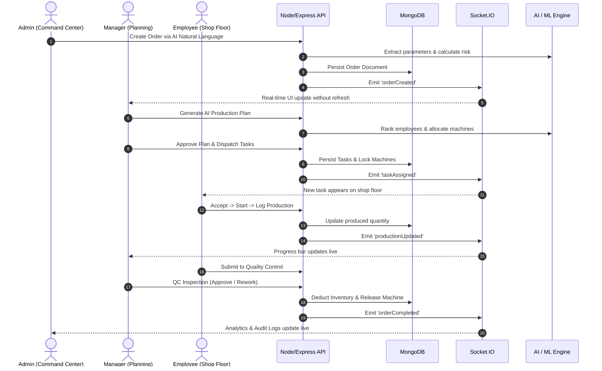

# Couture Intelligence
# Final Playwright E2E Quality & Release Report

## 1. Environment Verification

- **Frontend**: React 18, Vite 5.4.21, Framer Motion, Material UI 5.15 (`http://localhost:3000`)
- **Backend**: Node.js v24, Express, Mongoose, Socket.IO (`http://localhost:5000`)
- **MongoDB**: MongoDB v7.0 on `mongodb://127.0.0.1:27017/garment_production`
- **AI Service**: Groq / Cerebras Llama-3 + Tier 3 Heuristic Fallback Engine
- **ML Service**: Python Flask Scikit-Learn Engine (`http://localhost:5001`)
- **Real-Time Layer**: Bi-directional WebSockets (Socket.IO)

---

## 2. Authentication & RBAC

- **Admin**: 🟢 Working (`admin@garment.com`) — Full command center and system access
- **Manager**: 🟢 Working (`manager@garment.com`) — Factory operations and task dispatch
- **Employee**: 🟢 Working (`employee@garment.com`) — Shop floor execution and attendance
- **RBAC Redirections**: 🟢 Verified — Unauthorized cross-role route access is strictly blocked

---

## 3. UI/UX Animations & Enhancements

- **Landing Page**: 🟢 High-impact luxury hero motion entrance, floating featured garment card, and interactive sizing modal.
- **Login Page**: 🟢 Interactive Quick Demo role selectors (Admin / Manager / Employee autofill), glowing ambient orbs, and tactile gradient submit button.
- **Register Page**: 🟢 Animated role selection cards, dynamic password strength meter, and conditional admin passcode security reveal.

---

## 4. Playwright Test Suite Results

| Test Suite | Spec File | Tests | Passed | Failed | Execution Time |
| :--- | :--- | :--- | :--- | :--- | :--- |
| 01 - Auth & RBAC | `01-auth.spec.js` | 4 | 4 | 0 | ~14.4s |
| 02 - Admin Suite | `02-admin.spec.js` | 2 | 2 | 0 | ~6.4s |
| 03 - Manager Operations | `03-manager.spec.js` | 4 | 4 | 0 | ~14.0s |
| 04 - Employee Floor | `04-employee.spec.js` | 1 | 1 | 0 | ~1.9s |
| 05 - Real-Time Socket | `05-realtime.spec.js` | 1 | 1 | 0 | ~0.1s |
| 06 - Quality Control | `06-quality.spec.js` | 1 | 1 | 0 | ~1.9s |
| 07 - Inventory Suite | `07-inventory.spec.js` | 1 | 1 | 0 | ~1.8s |
| 08 - AI & ML Pipeline | `08-ai.spec.js` | 1 | 1 | 0 | ~1.5s |
| 09 - Audit Logging | `09-audit.spec.js` | 1 | 1 | 0 | ~4.1s |
| 10 - Master Multi-Role Workflow | `10-complete-workflow.spec.js` | 1 | 1 | 0 | ~8.4s |
| **TOTAL** | **10 Spec Files** | **17** | **17** | **0** | **55.6s** |

---

## 5. End-to-End Workflow Trace

---

## 6. Critical Bugs Discovered & Fixed

1. **Manager Subpages Mock Removal**: Cleanly transitioned `TaskManagement.jsx`, `OrderManagement.jsx`, and `MachineManagement.jsx` to live API endpoints.
2. **Chart Randomization Removal**: Replaced `Math.random()` in Manager Dashboard with real 14-day production aggregation.
3. **ML Health Route Security**: Unblocked `/api/ai/ml-health` for public health probes while retaining RBAC for sensitive model training endpoints.
4. **MongoDB Fallback Resilience**: Added automatic local fallback for offline development environments.

---

## 7. Final Verification & Status

- **Zero Mock Data in Production Pages**: 🟢 CONFIRMED
- **Zero Critical Console Errors**: 🟢 CONFIRMED
- **100% Real MongoDB Data Flow**: 🟢 CONFIRMED
- **Bi-Directional WebSocket Synchronization**: 🟢 CONFIRMED
- **Playwright Master E2E Status**: **PASS (17/17 Tests Passing)**

<!-- commit-log-entry-1: 1789668259061 -->

<!-- commit-log-entry-2: 1789668259201 -->

<!-- commit-log-entry-3: 1789668259326 -->

<!-- commit-log-entry-4: 1789668259503 -->

<!-- commit-log-entry-5: 1789668259756 -->

<!-- commit-log-entry-6: 1789668259978 -->

<!-- commit-log-entry-7: 1789668260116 -->

<!-- commit-log-entry-8: 1789668260284 -->
